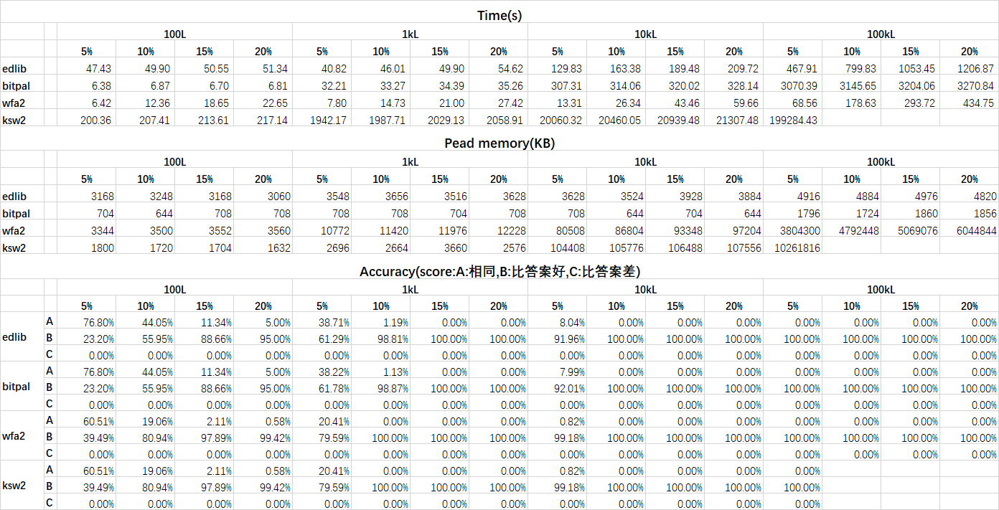

# Align_benchmark

### Experiment

The purpose of this benchmark is to assess various pairwise sequence alignment libraries. Unlike previous benchmarks, which only tested runtime and peak memory usage without assessing accuracy, this benchmark aims to test accuracy in addition to runtime and peak memory usage. 

The main steps of this benchmark are as follows:

1. Use PBSIM to simulate reads with fixed lengths and error rates, thereby generating pairwise sequence data for alignment.
2. Run different alignment libraries to generate pairwise sequence alignment results, including alignment scores and CIGAR strings.
3. Collect the alignment information from the answer files generated by PBSIM, including alignment scores and CIGAR strings.
4. Compare the results obtained in step 2 with the answer information from step 3 to evaluate accuracy metrics.

### Results

